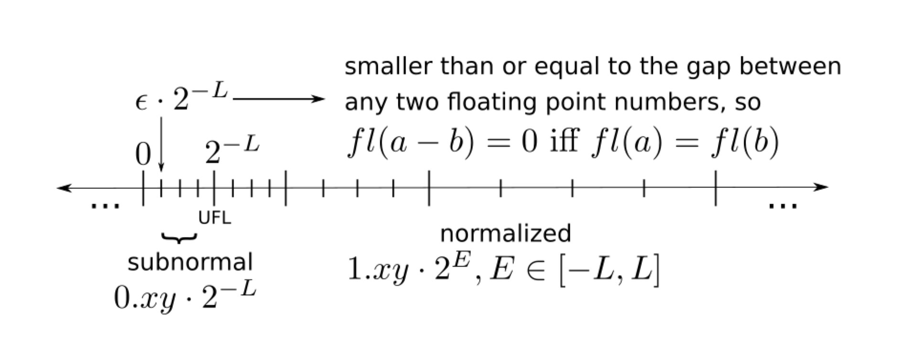

[toc]

# Computer Arithmetic

## Sourcec of Error

**Propagated data error (perturbations):** error due approximations in the input, $f(\hat{x}) - f(x)$.

**Truncation error:** algorithm uses exact arithmetic but have some approximations. For example, truncating a Taylor Series to approximate a function.

**Rounding error:** arithmetic operations on the finite-precision representation of real numbers genreate errors.

Total error = Truncation error + Rounding error + propogated data error. First two terms are computational error.

## Error Analysis

**Forward error:** difference between the actual result and the true result.

​	**Absolute error:** $\hat{y} - y$.

​	**Relative error:** $\frac{\hat{y} - y}{|y|}$.

**Backward error:** analyzing the forward propagation of errors is often difficult. Backward error is an alternative. We have the true function $f(x)$ and the algorithm to approximate is $\hat{f}(x)$. Let's say $\hat{f}(x=1) = 0.5$ and it defintiely has some forward errors. But we assume that due to some input data perturbations, the true function also get the same result $f(\hat{x} = 1 + \delta) = 0.5$. Under this case, we want to compute how much is that input data error $\delta$.

## Conditioning

**Absolute condition number:** $\kappa_{abs} = max_{x \in X}|\frac{df}{dx}(x)|$. $X$ is the space of input $x$.

**Condition number and error:** |relative forward error| = relative condition number * |Relative backward error|

**Accuracy:** we use an algorithm $\hat{f}(x)$ to approximate a function $f(x)$. The algorithm is accurate if $\hat{f}(x) = f(x)$ for all inputs x. It has nothing to do with the precision of number. 

**Stability:** an algorithm is stable if its output in finite precision is **always** near to the output in exact precision.

## Floating Point

Any floating-point number has the form: $x = \plusmn(d_0 + \frac{d_1}{\beta} + \frac{d_2}{\beta^2} + ... + \frac{d_{p-1}}{\beta^{p-1}})\beta^E$. It's like a scientific notation, where the polynomial parts are just digits. In binary case, $d_i$ could only be one or zero and $\beta$ (the base) is 2.

**Floating point approximation:** we denote the floating-point approximation of a given real number $x$ by $fl(x)$.

**Rounding:** The process of choosing a nearby floating-point number $fl(x)$ to approximate a given real number.

**Machine Epsilon (Machien Precision)**

It is an upper bound on the relative approximation error. $|\frac{fl(x) - x}{x}| \leq \epsilon_{mach}$. It's also defined as the maximum value that 1 can add on without changing the finite representation $fl(1 + \epsilon_{mach}) = 1$. More specifically, the machine precision $\epsilon_{mach} = \beta^{1-p}$. From the floating-point representation formula we could see that the least significant change is the variations of digits $d_{p-1}$ which only change the mantissa $\beta^{1-p}$. That's the machine epsilon.

In other words, it is the difference caused by the variations of the least significant digits.

### Normal System and Subnormal System

**Benefits of Normalization**

- The representation of each number is unique.
- Extra precision because no need to store leading one.

**What is UFL (under flow level)?** UFL is the boundary of normalized floating system to subnormal floating system. It is achieved when the mantissa and exponent are both at the smallest value, i.e. $1$ and $-L$. Thus, $UFL = 1 \cdot \beta^{-L} = 2^{-L}$ in binary situation.

**Why gaps between normalized numbers are increasing while gaps between subnormal numbers are even?**

In the normal system, $x = \plusmn\cdot mantissa \cdot \beta^E$. As the exponent increases, one digits change in mantissa generates a larger difference. However, in the subnormal system, the exponent is achieved at the lowest value which is $-L$ and will not change. Thus, the digits change in mantissa generates even differences.

## Rounding error in operations

Subtraction is actually the same with addition, just a different sign.

1. Subtraction between two p-digit numbers having the same sign and similar magintudes (not that close as the second case) yields a result with fewer than p significant digits and it's always exactly representable. 
2. However, if two nearly equal numbers are accurate only to within rounding error, then taking their differece leaves only rounding error and will be omitted. $(x + \epsilon) - (x - \epsilon) = x - x = 0$ where $\epsilon$ is slightly smaller than the machine precision. In other words, $x+\epsilon$ and $x-\epsilon$  are computed values and should have difference $2\epsilon > \epsilon_{mach}$. However, they are actually rounded first, so eventurally omit the difference. $fl(x\plusmn\epsilon) = x$. 
3. Subtraction (or addition) between small and large numbers. For example, $x_1 = 1.3788 \cdot10^2$ and $x^2=1.3579 \cdot 10^{-3}$. Those two number have the same precision but different exponents. The subtraction is $x_1 + x_2 = 1.378813479 \cdot 10^{2}$ which require extra precision to represent. The same in binary case.

$fl(x) \leq x(1+\epsilon)$.

**Is floating point addition associative?**

Not necessary. For example, the expression $(x+y)+z$ has a totally different answer than $x+(y+z)$ when $x = 10^{30}$, $y = -10^{30}$ and $z = 1$ It is 1 in the former case, 0 in the latter. Because adding y and z first will round of z (the third case above).

**Catastrophic cancellation**

https://en.wikipedia.org/wiki/Catastrophic_cancellation Similar to the second case. 

$$
\hat{x} - \hat{y} = x(1 + \delta_x) - y(1 + \delta_y) = (x - y) + x\delta_x - y\delta_y\\
= (x - y) + (x - y)\frac{x\delta_x - y\delta_y}{x - y}\\
= (x - y)(1 + \frac{x\delta_x - y\delta_y}{x - y})
$$
Ask question about the this on forum.

