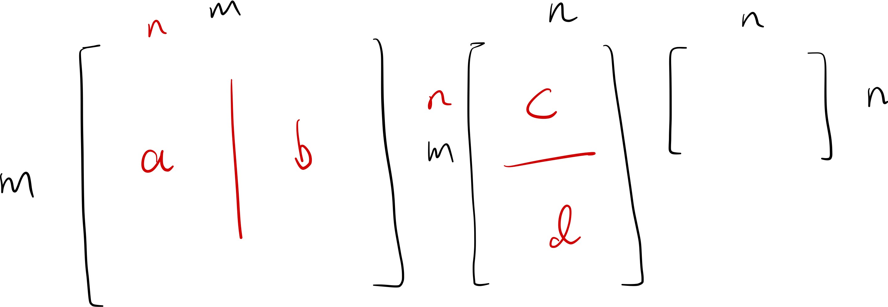

[toc]

## Space

### Row Space

### Column Space

### Null Space

## Residual

Residual vector is orthogonal to the span of A. 

Know how to compute the projection

## SVD

## How to solve a SVD

## Partial SVD

If we inverse a non-square matrix (usually we do this to compute the pseudo inverse matrix A), we could drop the columns after n-th column of U. Because those columns will multiply zero vectors in the $\Sigma $ matrix.

## Pseudo Inverse

SVD allows to generalize to nonsquare matrix A. $A = U\Sigma V^T$ is the SVD factorization. Then we have $U\Sigma V^Tx = b \implies x = V\Sigma^{-1}U^Tb$. In this case, $A^\dagger = V\Sigma^{-1}U^T$. In most cases, matrix A is non-square. However, we could still compute the economic SVD for A and the some of the diagonal terms of $\Sigma$ are zeros. It does not matter since we could use this matrix to compute $A^{\dagger}$, which finally result in a square matrix.

Then we can use the pseudo inverse of A to compute the condition nubmer of singular matrix A.

## Least Square

## Uniqueness of Least Square Solution

## Orghogonality

## Conditioning

### Normal Equations Method

## QR Factorization

